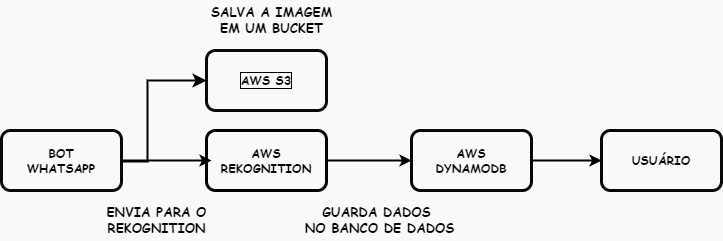

# image-analysis
### Projeto de Análise de Comprovantes PIX para Automatização de Caixa

Problema :
O processo manual de registro de entradas e saídas de uma conta comercial pode ser demorado e propenso a erros. Além disso, a necessidade de analisar comprovantes PIX de forma manual pode ser um desafio para os comerciantes.

Desafios de implementação:

- Implementar um sistema de análise de comprovantes PIX que seja preciso e eficiente.
- Superar as dificuldades com o sistema de permissões da AWS, garantindo a segurança e o acesso controlado aos recursos.
- Utilizar o Serverless Framework para facilitar o desenvolvimento e a implantação da aplicação.

O que aprendi:

- Desenvolvi habilidades em análise de dados e processamento de imagens para extrair informações dos comprovantes PIX.
- Aprofundei meu conhecimento em AWS, superando desafios com o sistema de permissões e aprendendo a utilizar o Serverless Framework de forma eficaz.
- Desenvolvi uma aplicação serverless escalável e segura, pronta para ser utilizada em um ambiente de produção.

# Guia
- [Features](#Features)
- [Instruções de execução](#Instruções-para-execução)
- [Contribua](#Contribua)

# Features


### Passo 1: Recebimento do Comprovante PIX

- O cliente envia o comprovante PIX para o WhatsApp do comerciante.
- O aplicativo recebe a imagem do comprovante PIX e inicia o processo de análise.

### Passo 2: Armazenamento da Imagem no AWS S3

- O Node.js envia a imagem do comprovante PIX para o AWS S3 para armazenamento.
- Isso permite que a imagem seja armazenada de forma segura e possa ser recuperada posteriormente, caso seja necessário.

### Passo 3: Detecção de Textos com AWS Rekognition

- A imagem do comprovante PIX é enviada para o AWS Rekognition para detecção de textos.
- O AWS Rekognition utiliza algoritmos de inteligência artificial para detectar e extrair os textos presentes na imagem.

### Passo 4: Armazenamento dos Dados no DynamoDB

- Os dados extraídos do comprovante PIX são armazenados no DynamoDB.
- O DynamoDB é um banco de dados NoSQL que permite armazenar e recuperar dados de forma rápida e eficiente.

### Passo 5: Retorno de Mensagem de Sucesso

- Após o armazenamento dos dados, o aplicativo retorna uma mensagem de sucesso para o usuário.
- Isso confirma que o comprovante PIX foi processado com sucesso e que os dados foram armazenados corretamente.

# Instruções para execução 
- Faça download do projeto e instale as dependencias
```
git clone https://github.com/rafaelssucupira/aws-rekognition-nodejs.git
npm install
```
- Crie um arquivo .env e defina um numero de whatsapp válido para se conectar 
```
NUMBER=XXXXXXX
```
- Configure o aws-cli, para posteriormente o Serveless Framework logar na sua conta aws
```
aws configure
```
- Em seguida execute o deploy na AWS através do Serveless Framework
```
npx sls deploy
```
- Agora execute, ele enviará um codigo no terminal para o pareamento com whatsapp 
```
npm run start
```
# Contribua
Estou muito feliz em saber que você está interessado em contribuir com esse projeto! Se você quer nos ajudar, dê uma olhadinha nas nossas issues abertas e siga uma das seguintes opções:

- Reportar um novo bug.
- Discutir a respeito das issues atuais e possíveis novas features.
- Corrigir um Bug ou implementar uma nova feature.
- Corrigir erros de digitação ou adicionar traduções.

Para enviar novos **Pull Requests**, siga os seguintes passos:
- Crie um fork do projeto
- Faça suas mudanças e implemente testes pra ela.
- Garanta que todos os testes passem.
- Crie seu Pull Request e aguarde o review.
